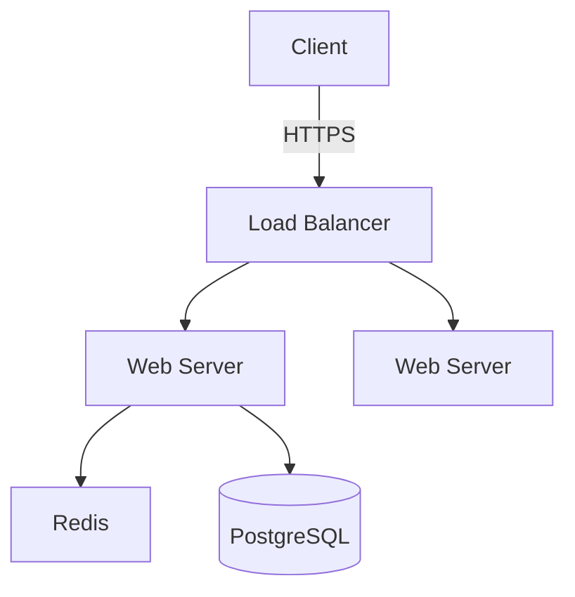
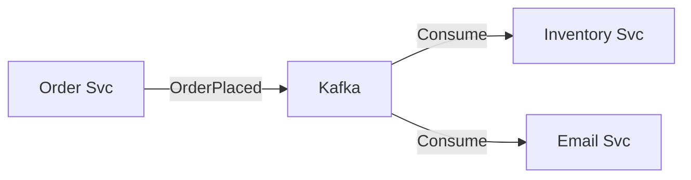

# Examples

## Capacity Estimation

### Social Media Feed (Back-of-Envelope)

```python
# Assumptions
DAU = 100_000_000
Posts_Per_User = 2
Avg_Post_Size = 1000 # bytes

# Write QPS
Write_QPS = (DAU * Posts_Per_User) / 86400
# 100M * 2 / 86400 ≈ 2,300 QPS

# Storage Per Year
Storage_Year = DAU * Posts_Per_User * 365 * Avg_Post_Size
# 100M * 2 * 365 * 1KB ≈ 73 TB/year
```

## Architecture Diagrams (Mermaid)

### Simple Web App



### Event-Driven Microservices



## Database Schema (Cassandra/NoSQL)

### Chat App Message Table

```sql
CREATE TABLE messages (
    channel_id uuid,
    message_id timeuuid,
    author_id uuid,
    content text,
    PRIMARY KEY ((channel_id), message_id)
) WITH CLUSTERING ORDER BY (message_id DESC);
```
